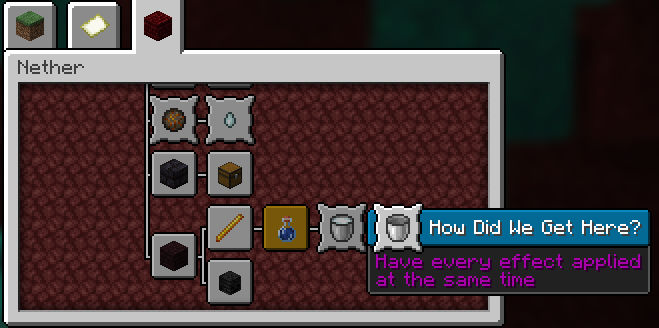
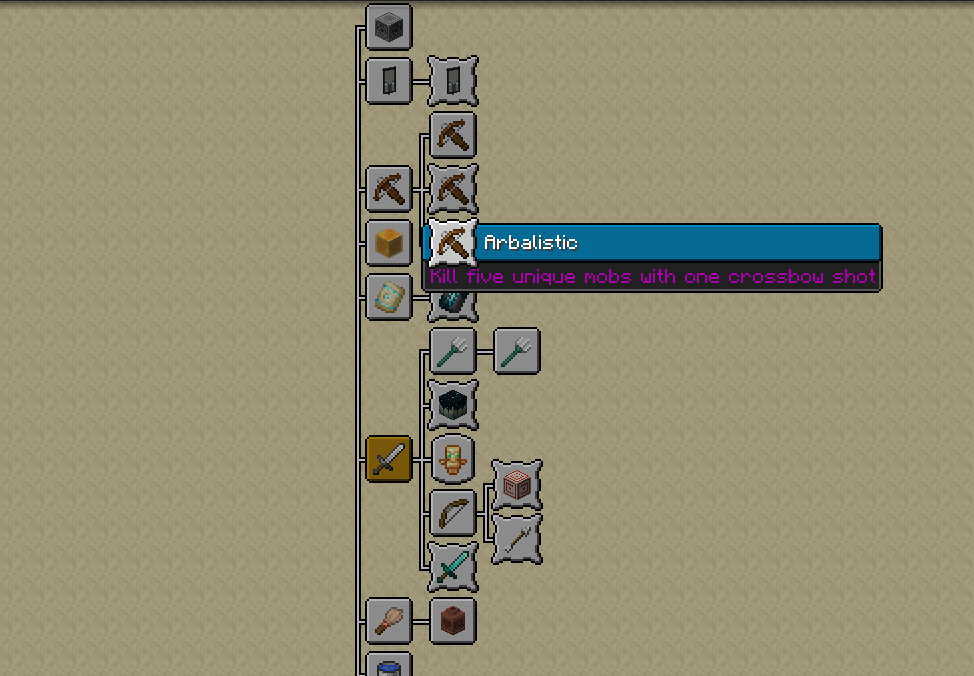

# No Hidden Advancements

A Minecraft Fabric mod that makes all hidden advancements visible in the UI

> **Intended to be paired with [Better Advancements](https://modrinth.com/mod/better-advancements).**
> The vanilla advancements screen only draws advancements the server sends the
> client (earned ones and their reachable neighbours), so on its own this mod
> only un-hides the `hidden`-flagged entries. Better Advancements changes the
> screen to render **all** advancements, and this mod complements it by
> revealing the hidden ones too. Install both for the full effect.

## Features

- Makes all hidden advancements visible in the UI:
  - "How Did We Get Here?"
  - "Voluntary Exile"
  - "Hero of the Village"
  - "Arbalistic"
  - "You've Got a Friend in Me"
  - "Smells Interesting"
  - "Birthday Song"
  - "Little Sniffs"
  - "Planting the Past"
- Compatible with Minecraft 26.2




## Download
- If you just want the mod itself and you don't care about the source code, just download the jar file for the corresponding Minecraft version from the releases folder

## Installation

1. Install [Fabric Loader](https://fabricmc.net/use/installer/)
2. Install [Fabric API](https://www.curseforge.com/minecraft/mc-mods/fabric-api)
3. Install [Better Advancements](https://modrinth.com/mod/better-advancements) (strongly recommended — needed to actually render all advancements)
4. Download the latest release of this mod
5. Place the mod files in your `mods` folder

## Building

To build the mod yourself:

1. Clone this repository
2. Run `./gradlew build`
3. The built mod will be in `build/libs/`

## Testing

### Development Testing

1. Run the mod in development environment:
   ```bash
   ./gradlew runClient
   ```

      **Note**: If you encounter mixin errors during startup, check that:
      - All package names in your mixin configuration files match your actual package structure
      - Mixin classes exist in the specified locations
      - The mod ID in `fabric.mod.json` matches your mixin configuration


## Usage

Install the mod (alongside [Better Advancements](https://modrinth.com/mod/better-advancements)) and open the Advancements screen as normal. Hidden advancements — the ones vanilla keeps invisible until you earn them — will now be shown, so you can see what's left to complete.

## Compatibility

- Minecraft: 26.2
- Fabric Loader: 0.19.3+
- Fabric API: 0.158.0+26.2
- Recommended: [Better Advancements](https://modrinth.com/mod/better-advancements)

## License

This mod is licensed under the MIT License. See [LICENSE](LICENSE) for details.
